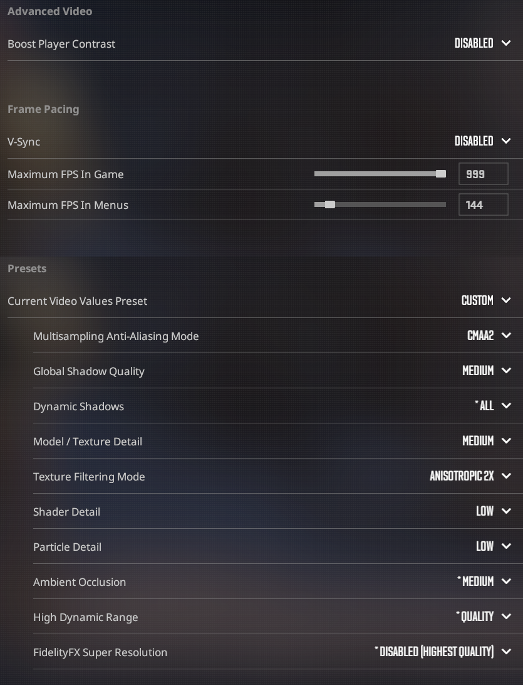
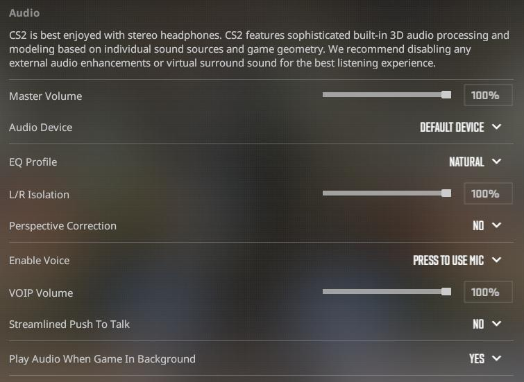
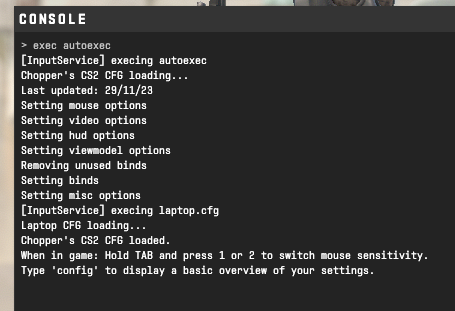
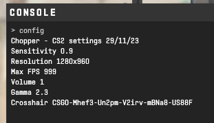

# Chopper's Counter-Strike: 2 Configuration

 Generated with https://github.com/Chopper1337/CS-CFG/

# Info

 Note that the binds in this CFG are created around the QWERTY UK keyboard layout.

 You may need to add `+exec autoexec.cfg` to your game launch options.

 **Last update**: 06/08/24

 Crosshair code: `CSGO-QwBne-zCdHX-eCHSD-uVcNU-cmtOH`

 **Mouse**: 1KHz polling rate, 800 DPI and 0.9 in game sens. ([Logitech G305](https://www.amazon.co.uk/Logitech-Wireless-Lightweight-Programmable-compatible/dp/B07CGPZ3ZQ))

 **Keyboard**: [ZSA Moonlander](https://www.zsa.io/moonlander/) - Gateron G Pro 2.0 Speed Silver switches [(custom layout)](https://configure.zsa.io/moonlander/layouts/vrKMn/latest/0)
 
 **Video**: 
 
 Resolution: 1440x1080

 

 **Audio**: 

 

**Hardware**:

 * Monitor: ASUS XG258Q
 * GPU: RX 6800
 * CPU: R5 5600X

# Features
 
 * Scroll bhop
 * Easily switch between two different mouse sensitivities
 * Improved viewmodel
 * Toggle crosshair recoil
 * Targets acquired

# Communication Bindings

 * **enter** - Global chat
 * **.** - Team chat
 * **v** - Voice chat

# Util Bindings

 * **T** - Molotov
 * **4** - HE Grenade
 * **Mouse 4** - Smoke
 * **Mouse 5** - Flash

 # While holding TAB
 * **1** and **2** - Set mouse sensitivity to 0.9 or 1.8
 * **Mouse 3** - Spray graffiti

# Other Bindings

 * **I** - Fix audio delay*
 * **O** - Toggle crosshair recoil
 * **U** - Toggle null binds
 * **DELETE** - Executes `autoexec.cfg`

*In some cases, audio can become delayed (desynced from video) over time. The longer the game runs, the worse the delay gets.
This switches the default audio device which resets the delay. Press this key whenever your audio seems delayed.

# Screenshots

 Upon executing autoexec.cfg:

 

 The 'config' command:

 

# Generation

 1. Open the generation script you will be using.
 
    If you are on **Linux**, use `generate.sh`.
    
    On **Windows**, use `generateWin.ps1`.

 2. Replace the values for the variables per your preference.

 3. Replace the `video.png` and `audio.png` screenshots in the images folder.

 4. Run the generation script.
