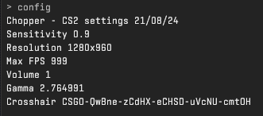

# Chopper's Counter-Strike: 2 Configuration

 Generated with https://github.com/Chopper1337/CS-CFG/

# Info

 Note that the binds in this CFG are created around the QWERTY UK keyboard layout.

 You may need to add `+exec autoexec.cfg` to your game launch options.

 **Last update**: 29/11/23

 Crosshair code: `CSGO-Mhef3-Un2pm-V2irv-mBNa8-US88F`

 **Mouse**: 1khz polling rate, 800dpi and 0.9 in game sens. ([Logitech G305](https://www.amazon.co.uk/Logitech-Wireless-Lightweight-Programmable-compatible/dp/B07CGPZ3ZQ))

 **Keyboard**: ZSA Moonlander - Gateron G Pro 2.0 Speed Silverswitches - [Layout](https://configure.zsa.io/moonlander/layouts/vrKMn/latest/0)
 
 **Video**: 
 
 * Resolution: 1280x960
 * Shadows: High
 * FSR: OFF
 * Everything else at lowest.

**Hardware**:

 * Monitor: ASUS XG258Q
 * GPU: RX 6800
 * CPU: R5 5600X

# Generation

 1. Open the generation script you will be using.
 
    If you are on **Linux**, use `generate.sh`.
    
    On **Windows**, use `generateWin.ps1`.

 2. Replace the values for the variables per your preference.

 3. Run the generation script.

# Features
 
 * Scroll bhop
 * Easily switch between two different mouse sensitivities
 * Improved viewmodel
 * Toggle crosshair recoil
 * Targets acquired

# Communication Bindings

 * **enter** - Global chat
 * **.** - Team chat
 * **v** - Voice chat

# Util Bindings

 * **T** - Molotov
 * **4** - HE Grenade
 * **Mouse 4** - Smoke
 * **Mouse 5** - Flash

 # While holding TAB
 * **1** and **2** - Set mouse sensitivity to 0.9 or 1.8
 * **Mouse 3** - Spray graffiti

# Other Bindings

 * **I** - Fix audio delay*
 * **O** - Toggle crosshair recoil
 * **DELETE** - Executes `autoexec.cfg`

*In some cases, audio can become delayed (desynced from video) over time. The longer the game runs, the worse the delay gets.
This switches the default audio device which resets the delay. Press this key whenever your audio seems delayed.

# Screenshots

 Upon executing autoexec.cfg:

 

 The 'config' command:

 

# TODO

 * Move all variables into a variables file which both bash and ps can refer to.
 * Interaction sounds* (switching weapon, interacting with doors, vents etc.)

 *not yet possible (afaik)
